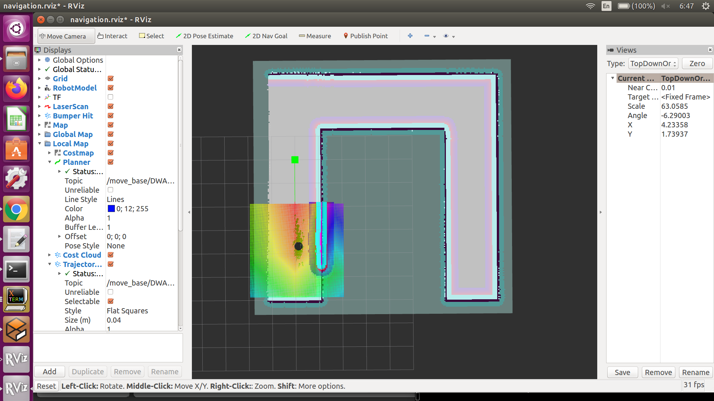
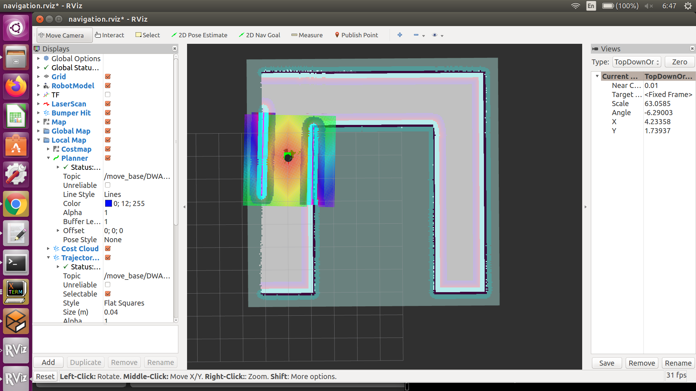
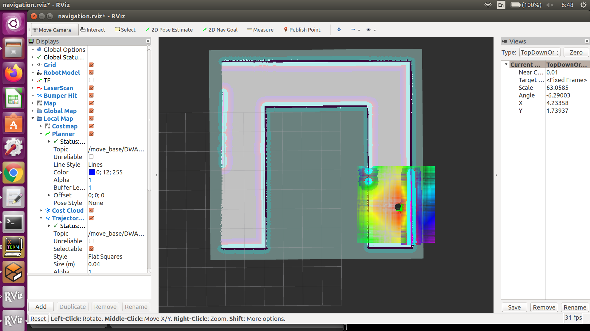

# nd209-home-service-robot-capstone
## Project setup 

Create catkin workspace:
```sh
$ mkdir ~/catkin_ws/src
$ cd ~/catkin_ws/src
```

Git clone this repo into the src folder.
Then, run catkin_make to build the project.

```sh
$ cd ~/catkin_ws
$ source devel/setup.bash
$ catkin_make
```

To deploy the home service robot, Run `home_service.sh` in the `scripts` folder

## Results

# Initial Object Placement


# Pick Up Object


# Drop Off Object

